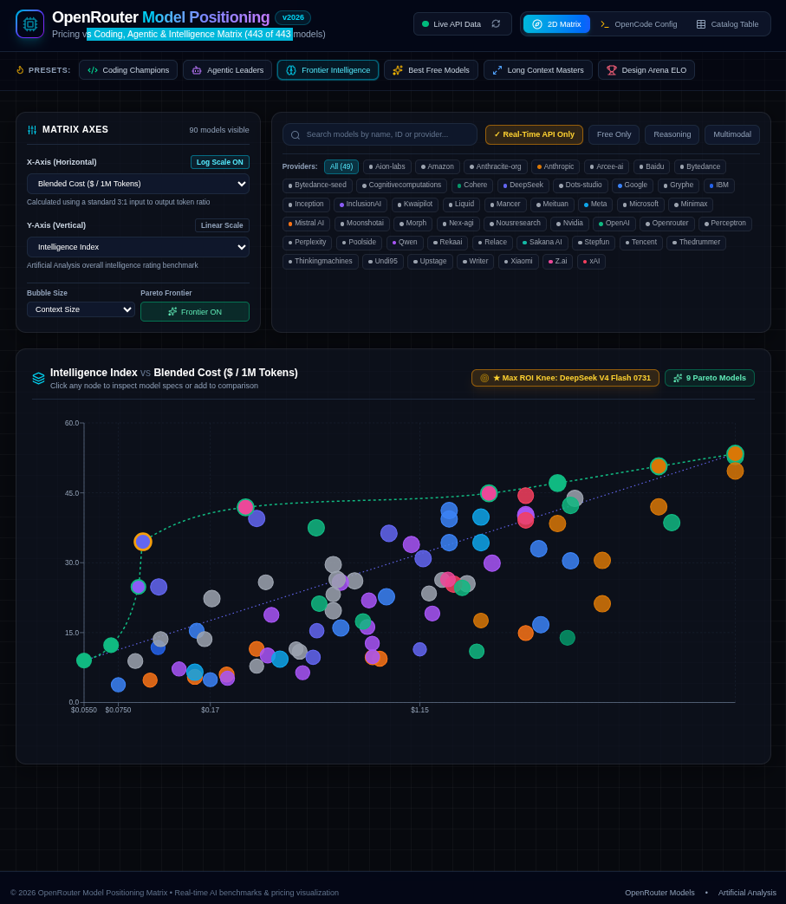

# OpenRouter Model Chooser 🚀

> **An interactive visual matrix to explore LLM pricing vs. performance, find Pareto-optimal models, and generate optimized OpenCode configurations.**
>
> ⚡ *This project was vibe coded entirely with AI.*

---

## 📸 Preview



---

## 🎯 Overview

With 400+ models available on [OpenRouter](https://openrouter.ai/models), selecting the right model for your specific workload and budget can be challenging. **OpenRouter Model Chooser** provides an interactive **2D Positioning Matrix** plotting model capabilities directly against real-time API costs.

Whether you need peak coding performance, maximum tool-calling precision, or budget sub-10¢ execution, this tool helps you visualize trade-offs instantly.

---

## 🌟 Key Features

- 📊 **Interactive 2D Matrix (Scatter Plot)**: Plot model costs (`$/1M tokens`) against **Coding Index**, **Agentic Index**, **Intelligence Index**, and **Context Window** size.
- 📐 **Pareto Frontier & Kneedle Algorithm**: Automatically calculates the Pareto-efficient frontier and highlights the mathematical **Max ROI Knee Point (Elbow)** for maximum performance per dollar.
- ⚡ **Real-Time API Pricing**: Excludes `:batch` pricing from interactive model calculations so pricing and ROI decisions reflect actual real-time streaming API costs.
- ⚙️ **OpenCode Config Generator (Experimental)**: Automatically generates optimized `opencode.json` configuration snippets mapping Max ROI Knee models to OpenCode native agent modes (`build`, `plan`, `general`).
- 🔍 **Filter & Catalog Table**: Fast search across 400+ models, provider filter chips (OpenAI, Anthropic, Google, DeepSeek, Meta, Qwen, Z.ai, etc.), free tier toggles, and 1-click CSV export.

---

## 🤖 Vibe Coded

This entire application was **vibe coded from scratch** using **Google Antigravity AI**. From the design system, reactive Pareto algorithm, and logarithmic chart overlays to containerization and OpenCode integration—everything was created through conversational AI pair programming.

---

## 🚀 Quick Start

Run the application inside an isolated container without installing local toolchains on your host:

```bash
# 1. Build static assets & container image
make container

# 2. Start container (opens on http://localhost:8080)
make run

# 3. Stop container when finished
make stop
```

---

## ⚙️ OpenCode Integration (Experimental)

Generate ready-to-use OpenCode configurations directly from the **OpenCode Config** tab:

```json
{
  "$schema": "https://opencode.ai/config.v1.json",
  "model": "openrouter/deepseek/deepseek-v4-flash-0731",
  "agent": {
    "build": {
      "model": "openrouter/deepseek/deepseek-v4-flash-0731"
    },
    "plan": {
      "model": "openrouter/z-ai/glm-5.3-flash"
    },
    "general": {
      "model": "openrouter/deepseek/deepseek-v4-flash-0731"
    }
  }
}
```

Place this file in `~/.config/opencode/opencode.json` or your project root and launch `opencode`.

---

## 📄 License

[MIT](LICENSE) © 2026
